---
## Front matter
lang: ru-RU
title: Отчёт по выполнению лабораторной работы №1
subtitle: Установка и настройка Fedora Sway
author:
  - Приходько И. И.
institute:
  - Российский университет дружбы народов, Москва, Россия
date: 06 марта 2025

## i18n babel
babel-lang: russian
babel-otherlangs: english

## Formatting pdf
toc: false
toc-title: Содержание
slide_level: 2
aspectratio: 169
section-titles: true
theme: metropolis
header-includes:
 - \metroset{progressbar=frametitle,sectionpage=progressbar,numbering=fraction}
---

# Информация

## Докладчик

:::::::::::::: {.columns align=center}
::: {.column width="70%"}

  * Приходько Иван Иванович
  * Студент
  * Российский университет дружбы народов
  * [1132246285@rudn.ru](mailto:1132246285@rudn.ru)

:::
::: {.column width="30%"}

:::
::::::::::::::

## Цель

Приобретение практических навыков установки операционной системы Linux Sway. 

## Задание

Установка операционной системы
Установка драйверов для VirtualBox
Настройки раскладки клавиатуры
Установка имени пользователя и хоста
Установка программного обеспечения для будущих лабораторных работ

## Установка Fedora Sway

Создадим виртуальную машину и назовем её Sway

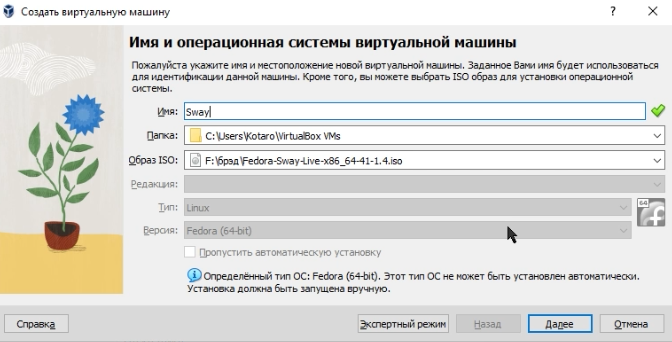{height=66%}

## Установка Fedora Sway

Выделяем память и кол-во процессоров 

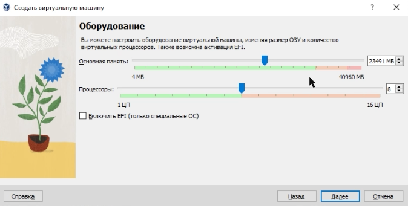{height=66%}

## Установка Fedora Sway

Выделяем 80 гб для диска 

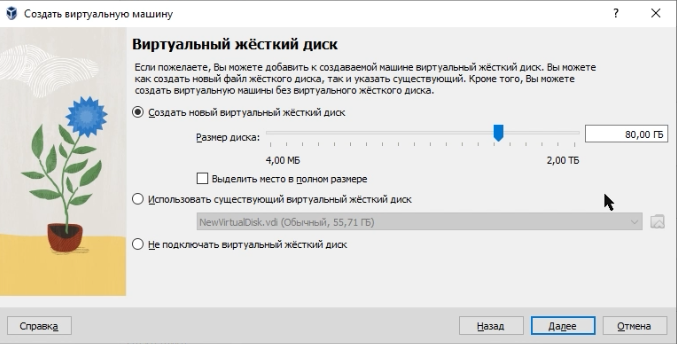{height=66%}

## Установка Fedora Sway

Включаем 3D ускорение 

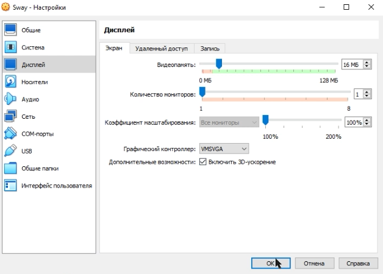{height=66%}

## Установка Fedora Sway

Нажимаеи Win+D и прописываем liveinst, чтобы установить линукс 

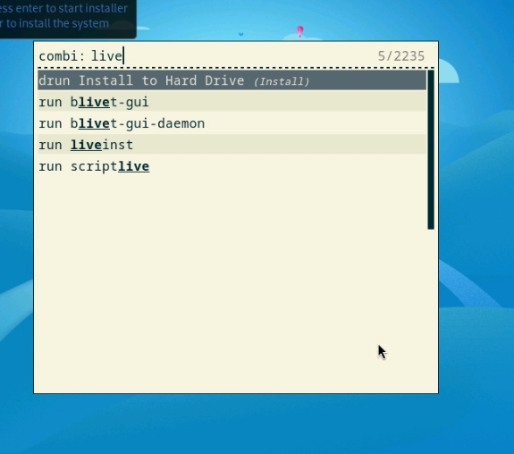{height=66%}

## Установка Fedora Sway

Выбираем русский язык 

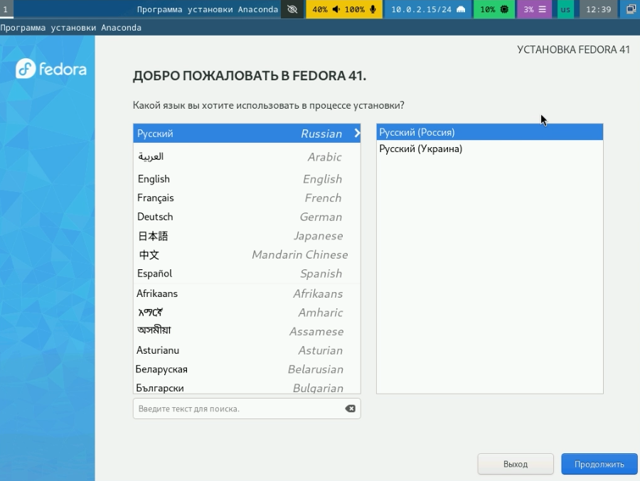{height=66%}

## Установка Fedora Sway

Указываем диск  

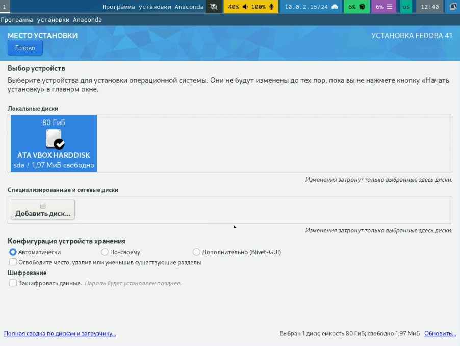{height=66%}

## Установка Fedora Sway

Включим root пользователя и укажем пароль 

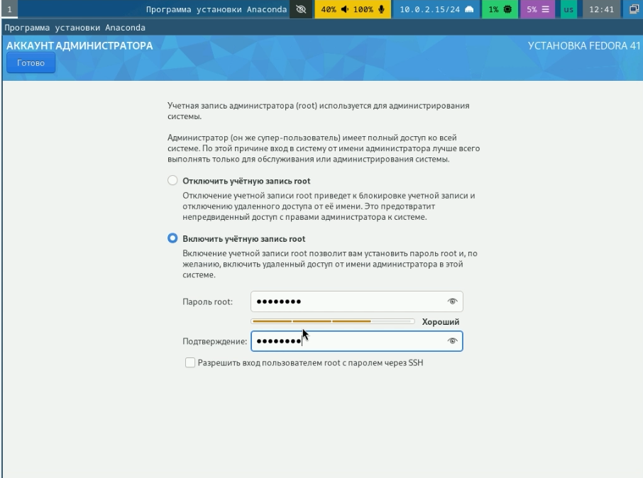{height=66%}

## Установка Fedora Sway

Создадим пользователя 

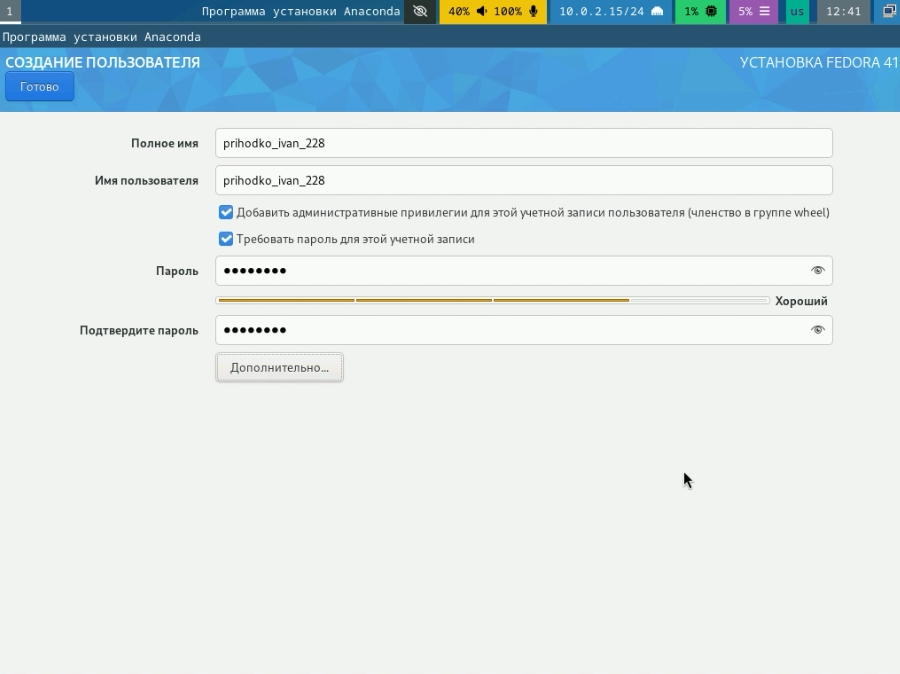{height=66%}

## Установка Fedora Sway

После этого устанавливаем все, выключаем машину и убираем установочный диск  

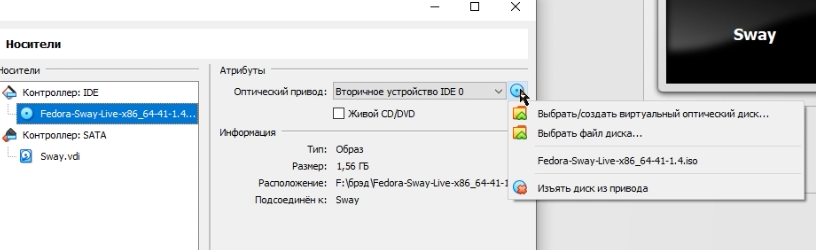{height=66%}

## Переход в режим суперпользователя

Переходим в режим суперпользователя 

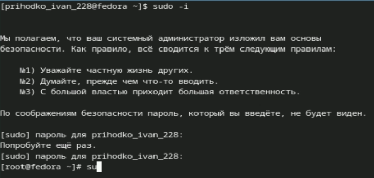{height=66%}

## Обновление всех пакетов

Обновляем все пакеды dnf 

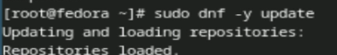{height=66%}

## Повышение комфорта работы

Устанавливаем tmux 

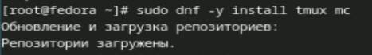{height=66%}

## Отключение SELinux

Отключаем SELinux 

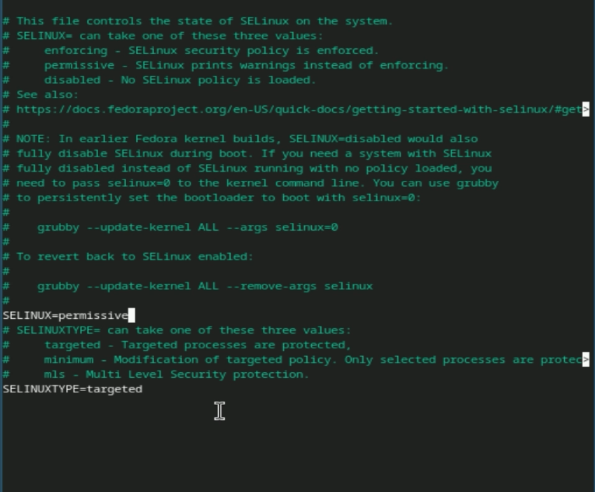{height=66%}

## Установка драйверов для VirtualBox

Переходим в tmux и перехдим на роль суперпользователя 

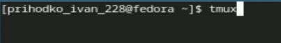{height=66%}

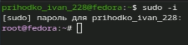{height=66%}

## Установка драйверов для VirtualBox

Устанавливаем иструменны разработчика 

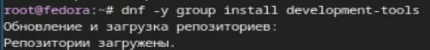{height=66%}

## Установка драйверов для VirtualBox

Устанавливаем dkms 

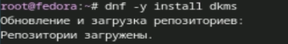{height=66%}

## Установка драйверов для VirtualBox

Подключаем образ диска гостевого ОС 

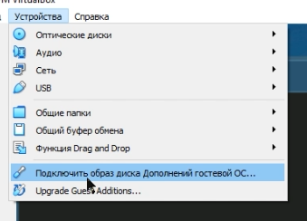{height=66%}

## Установка драйверов для VirtualBox

Примонтируем его и запустим скрипт установщик 

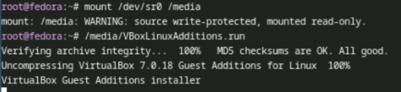{height=66%}

## Настройка раскладки клавиатуры

Создаем конфиг файл для раскладки клавиатуры 

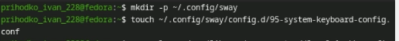{height=66%}

## Настройка раскладки клавиатуры

Вставляем туда команду 

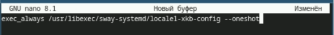{height=66%}

## Настройка раскладки клавиатуры

В другой конфиг файл добавляем следующие строчки 

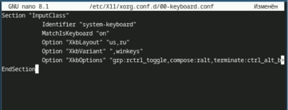{height=66%}

## Установка названия хоста

Меняем имя хоста 

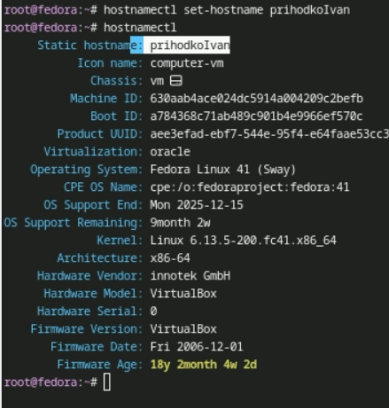{height=66%}

## Установка программного обеспечения для создания документации

Устанавливаем pandoc 

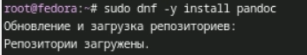{height=66%}

## Установка программного обеспечения для создания документации

Распаковываем и перещаем файлы для pandoc-crossref 

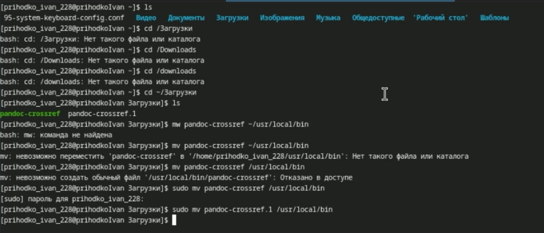{height=66%}

## Установка программного обеспечения для создания документации

Устанавливаем texlive 

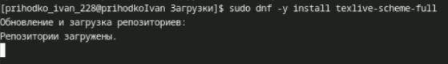{height=66%}

# Домашнее задание

:::::::::::::: {.columns align=center}
::: {.column width="60%"}

Версия линукса — 6.13.5
Частота процессора — 3792.872 MHz
Модель процессора — AMD Ryzen 7 5800X
Объём оперативной памяти — 2 MKB
Тип гипервизера — KVM
Тип файловой корневой системы - BTRFS
Последовательность монтирования файловых систем — BTRFS, EXT4-fs
 

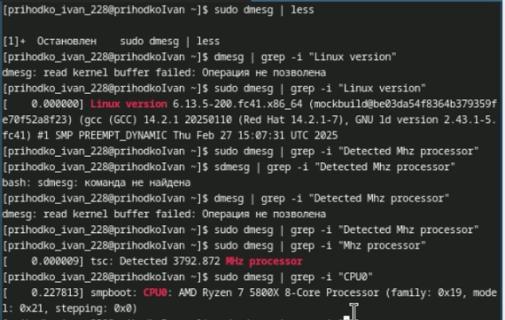{height=66%}

{height=66%}

# Выводы

Были получены навыки работы в системе Fedora Sway, была проведена установка системы, установлены необходимые для последующей работы пакеты и произведена базовая настройка системы
