---
## Front matter
title: "Отчёт"
subtitle: "Лабораторная работа № 1"
author: "Приходько Иван Иванович"

## Generic otions
lang: ru-RU
toc-title: "Содержание"

## Bibliography
bibliography: bib/cite.bib
csl: pandoc/csl/gost-r-7-0-5-2008-numeric.csl

## Pdf output format
toc: true # Table of contents
toc-depth: 2
lof: true # List of figures
lot: true # List of tables
fontsize: 12pt
linestretch: 1.5
papersize: a4
documentclass: scrreprt
## I18n polyglossia
polyglossia-lang:
  name: russian
  options:
	- spelling=modern
	- babelshorthands=true
polyglossia-otherlangs:
  name: english
## I18n babel
babel-lang: russian
babel-otherlangs: english
## Fonts
mainfont: IBM Plex Serif
romanfont: IBM Plex Serif
sansfont: IBM Plex Sans
monofont: IBM Plex Mono
mathfont: STIX Two Math
mainfontoptions: Ligatures=Common,Ligatures=TeX,Scale=0.94
romanfontoptions: Ligatures=Common,Ligatures=TeX,Scale=0.94
sansfontoptions: Ligatures=Common,Ligatures=TeX,Scale=MatchLowercase,Scale=0.94
monofontoptions: Scale=MatchLowercase,Scale=0.94,FakeStretch=0.9
mathfontoptions:
## Biblatex
biblatex: true
biblio-style: "gost-numeric"
biblatexoptions:
  - parentracker=true
  - backend=biber
  - hyperref=auto
  - language=auto
  - autolang=other*
  - citestyle=gost-numeric
## Pandoc-crossref LaTeX customization
figureTitle: "Рис."
tableTitle: "Таблица"
listingTitle: "Листинг"
lofTitle: "Список иллюстраций"
lotTitle: "Список таблиц"
lolTitle: "Листинги"
## Misc options
indent: true
header-includes:
  - \usepackage{indentfirst}
  - \usepackage{float} # keep figures where there are in the text
  - \floatplacement{figure}{H} # keep figures where there are in the text
---

# Цель работы

Приобретение практических навыков установки операционной системы Linux Sway. 

# Задание

Установка операционной системы
Установка драйверов для VirtualBox
Настройки раскладки клавиатуры
Установка имени пользователя и хоста
Установка программного обеспечения для будущих лабораторных работ

# Выполнение лабораторной работы

Создадим виртуальную машину и назовем её Sway (рис. [-@fig:001]).

{#fig:001 width=70%}

Выделяем память и кол-во процессоров (рис. [-@fig:002]).

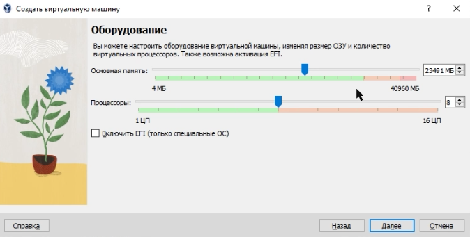{#fig:002 width=70%}

Выделяем 80 гб для диска (рис. [-@fig:003]).

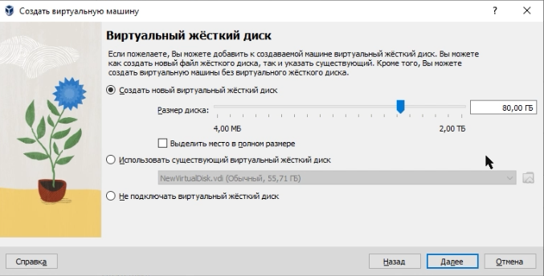{#fig:003 width=70%}

Включаем 3D ускорение (рис. [-@fig:004]).

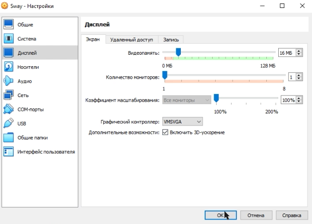{#fig:004 width=70%}

Нажимаеи Win+D и прописываем liveinst, чтобы установить линукс (рис. [-@fig:005]).

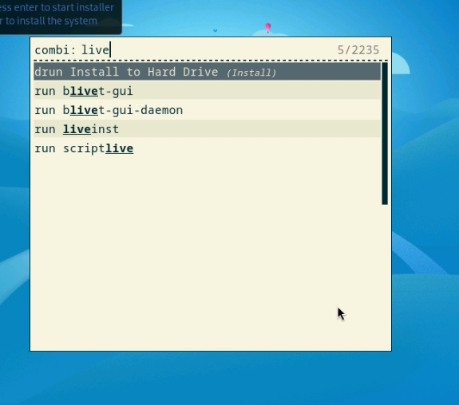{#fig:005 width=70%}

Выбираем русский язык(рис. [-@fig:006]).

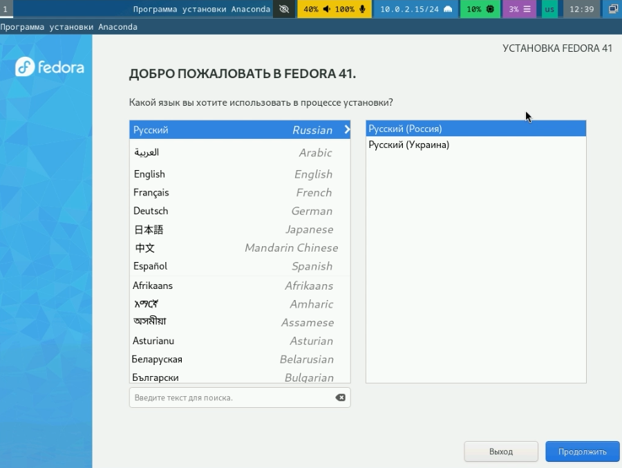{#fig:006 width=70%}

Указываем диск (рис. [-@fig:007]).

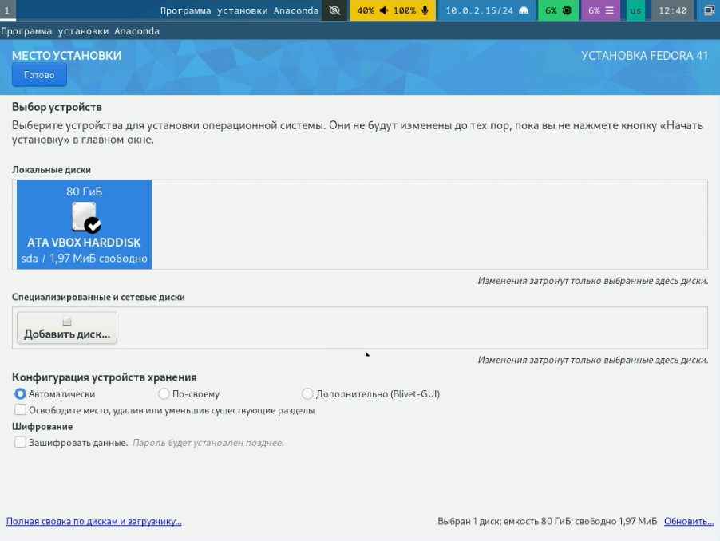{#fig:007 width=70%}

Включим root пользователя и укажем пароль (рис. [-@fig:008]).

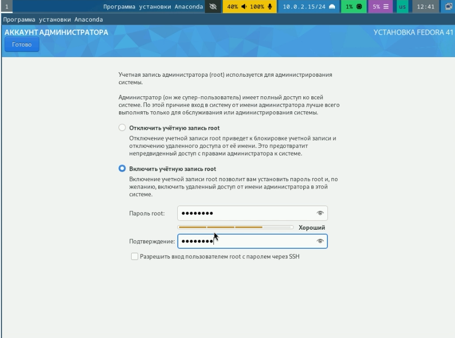{#fig:008 width=70%}

Создадим пользователя (рис. [-@fig:009]).

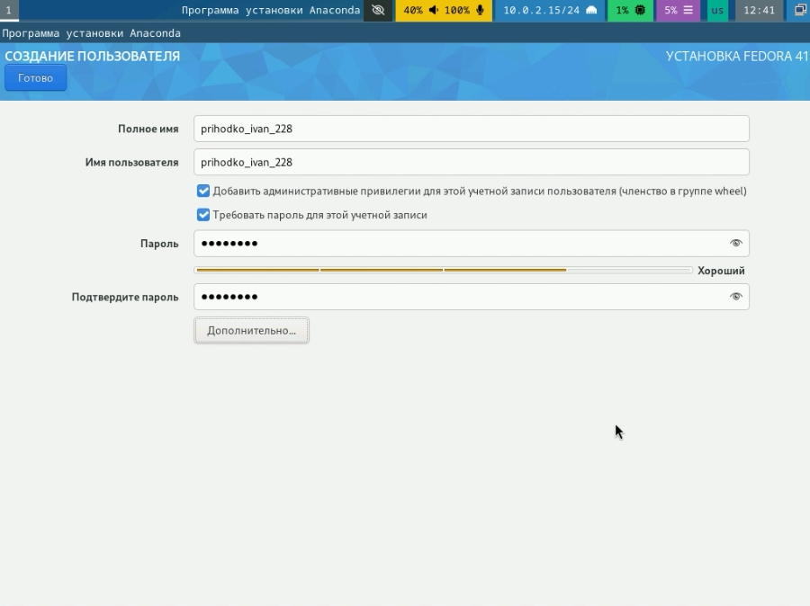{#fig:009 width=70%}

После этого устанавливаем все, выключаем машину и убираем установочный диск (рис. [-@fig:010]).

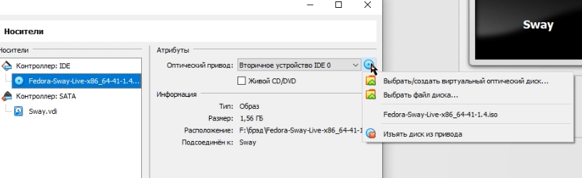{#fig:010 width=70%}

Переходим в режим суперпользователя (рис. [-@fig:011]).

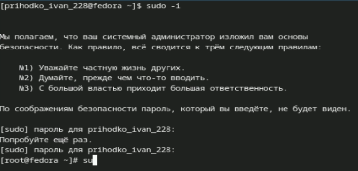{#fig:011 width=70%}

Обновляем все пакеды dnf(рис. [-@fig:012]).

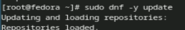{#fig:012 width=70%}

Устанавливаем tmux (рис. [-@fig:013]).

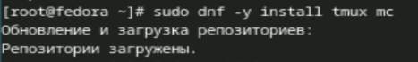{#fig:013 width=70%}

Отключаем SELinux (рис. [-@fig:014]).

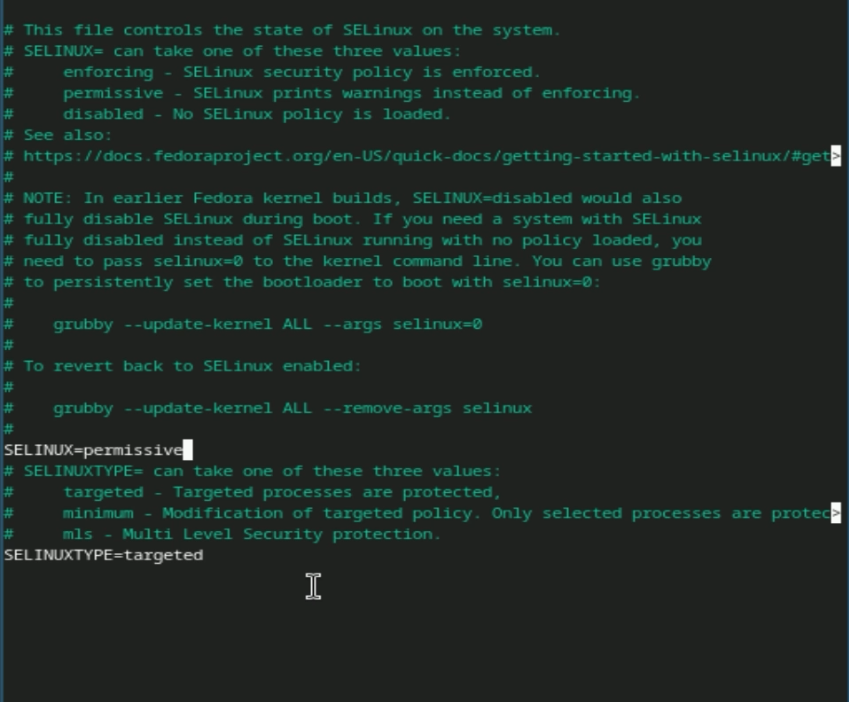{#fig:014 width=70%}

Переходим в tmux и перехдим на роль суперпользователя (рис. [-@fig:015]-[-@fig:016]).

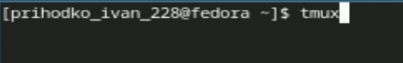{#fig:015 width=70%}

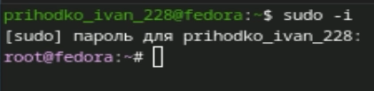{#fig:016 width=70%}

Устанавливаем иструменны разработчика (рис. [-@fig:017]).

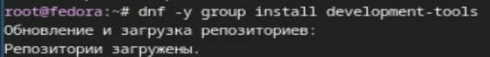{#fig:017 width=70%}

Устанавливаем dkms (рис. [-@fig:018]).

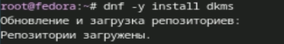{#fig:018 width=70%}

Подключаем образ диска гостевого ОС (рис. [-@fig:019]).

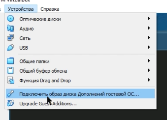{#fig:019 width=70%}

Примонтируем его и запустим скрипт установщик (рис. [-@fig:020]).

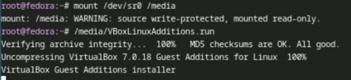{#fig:020 width=70%}

Создаем конфиг файл для раскладки клавиатуры (рис. [-@fig:021]).

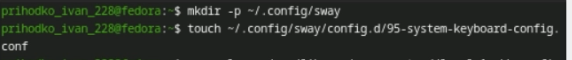{#fig:021 width=70%}

Вставляем туда команду (рис. [-@fig:022]).

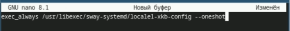{#fig:022 width=70%}

В другой конфиг файл добавляем следующие строчки (рис. [-@fig:023]).

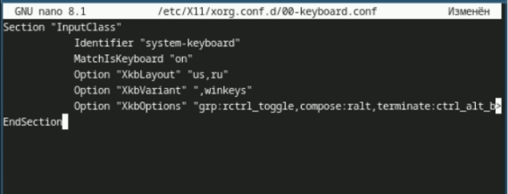{#fig:023 width=70%}

Меняем имя хоста (рис. [-@fig:024]).

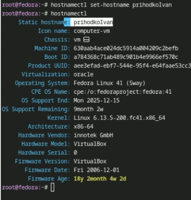{#fig:024 width=70%}

Устанавливаем pandoc (рис. [-@fig:025]).

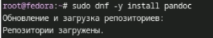{#fig:025 width=70%}

Распаковываем и перещаем файлы для pandoc-crossref (рис. [-@fig:026]).

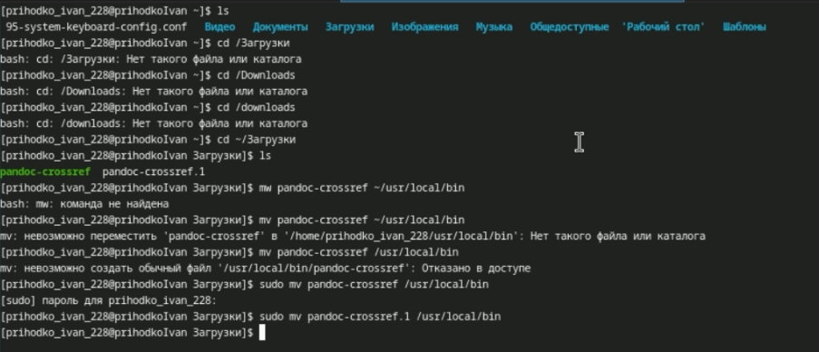{#fig:026 width=70%}

Устанавливаем texlive (рис. [-@fig:027]).

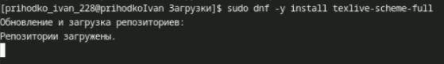{#fig:027 width=70%}

# Домашнее задание

Версия линукса — 6.13.5
Частота процессора — 3792.872 MHz
Модель процессора — AMD Ryzen 7 5800X
Объём оперативной памяти — 2 MKB
Тип гипервизера — KVM
Тип файловой корневой системы - BTRFS
Последовательность монтирования файловых систем — BTRFS, EXT4-fs
(рис. [-@fig:028]-[-@fig:029]).

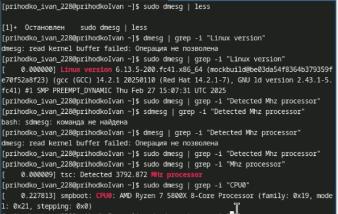{#fig:028 width=70%}

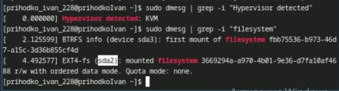{#fig:029 width=70%}

# Выводы

Были получены навыки работы в системе Fedora Sway, была проведена установка системы, установлены необходимые для последующей работы пакеты и произведена базовая настройка системы

# Ответы на контрольные вопросы

1. Какую информацию содержит учётная запись пользователя?
 -Логин пользователя, пароль пользователя, его ID, ID его группы, дополнительная информация (настоящее имя, почта), домашний каталог пользователя  
2. Укажите команды терминала и приведите примеры:  
для получения справки по команде  
 -Используется команда man. Например: man cd – узнать, что делает команда cd  
для перемещения по файловой системе  
 -Используется команда cd. Например: cd ~ - переместиться в домашний каталог  
для просмотра содержимого каталога  
 -Используется команда ls. Например: ls / - посмотреть содержимое корневого каталога  
для определения объёма каталога  
 -Используется команда du. Например: du – выводит размер всех подкаталогов и файлов в каталоге  
для создания / удаления каталогов / файлов  
 -Для создания файлов: touch. Например: touch /test.txt – создать файл test.txt в корне  
 -Для удаления файлов: rm. Например: rm /test.txt – удалить файл test.txt в корне  
 -Для создания каталогов: mkdir. Например: mkdir /test – создать папку test в корне  
 -Для удаления каталогов: rmdir. Например: rmdir /test – удалить папку test в корне  
для задания определённых прав на файл / каталог  
 -Используется команда chmod. Например: chmod +x /test – разрешить исполнение файла test всеми группами и пользователями  
для просмотра истории команд.  
 -Используется команда history. Например: history – выведет историю команд  
3. Что такое файловая система? Приведите примеры с краткой характеристикой.  
 -Файловая система – это система организации файлов в операционной системе. Например:   
FAT – одна из старых файловых систем, представленных Microsoft, не поддерживала шифрование, права пользователей к файлам и не имела возможности журналирования  
EXT4 – Более современная файловая система, которая активно используется в linux, поддерживает журналирование, шифрование и права пользователей к файлам  
4. Как посмотреть, какие файловые системы подмонтированы в ОС?  
Можно посмотреть с помощью утилиты df  
5. Как удалить зависший процесс?  
По PID с помощью команды kill, либо по имени с помощью команды killall

