---
## Front matter
lang: ru-RU
title: Лабораторная работа №2
subtitle: Презентация
author:
  - Приходько И. И.
institute:
  - Российский университет дружбы народов, Москва, Россия

## i18n babel
babel-lang: russian
babel-otherlangs: english

## Formatting pdf
toc: false
toc-title: Содержание
slide_level: 2
aspectratio: 169
section-titles: true
theme: metropolis
header-includes:
 - \metroset{progressbar=frametitle,sectionpage=progressbar,numbering=fraction}
---

# Информация

## Докладчик

:::::::::::::: {.columns align=center}
::: {.column width="70%"}

  * Приходько Иван Иванович
  * Студент
  * Российский университет дружбы народов
  * [1132246285@pfur.ru](mailto:1132246285@pfur.ru

:::
::: {.column width="30%"}

:::
::::::::::::::

## Цель работы

Изучить идеологию и применение средств контроля версий. Освоить умения по работе с git.

## Задание

Создать базовую конфигурацию для git.
Создать ключ SSH и PGP.
Зарегистрироваться на Github.
Создать локальный каталог для выполнения заданий поп предмету.

## Установка git

Для начала установим git

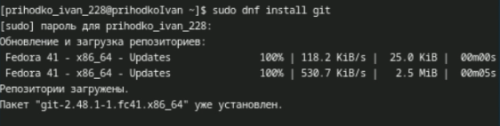{height=60%}

## Установка gh

Далее установим gh 

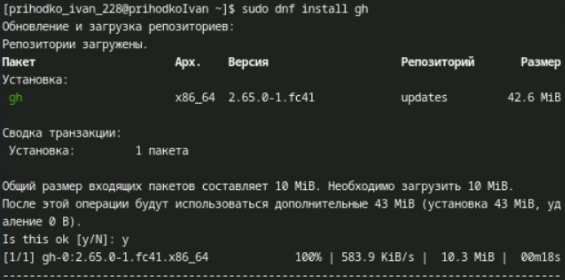{height=60%}

## Базовая настройка git

Далее зададим имя владельца репозитория и его почту

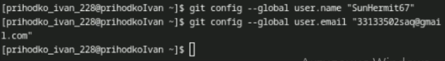{height=60%}

## Базовая настройка git

Установим имя начальной ветки, параметр autocrlf и safecrlf

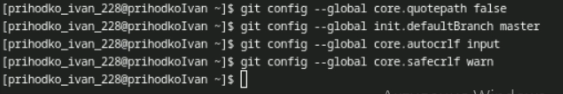{height=60%}

## Создание ключа ssh

Создадим RSA ключ размером 4096

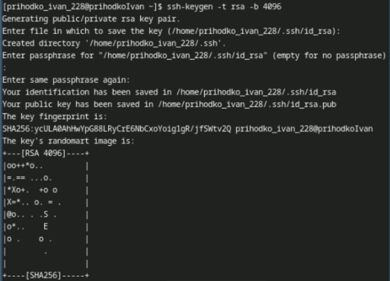{height=60%}

## Создание ключа ssh

Далее создадим ключ по алгоритму ed25519

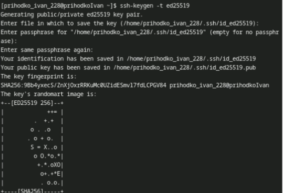{height=60%}

## Создание ключа pgp

Создадим PGP ключ. Выбираем тип «RSA and RSA», на 4096 бит и срок неограничен. Далее вводим свои данные и генерируем ключ

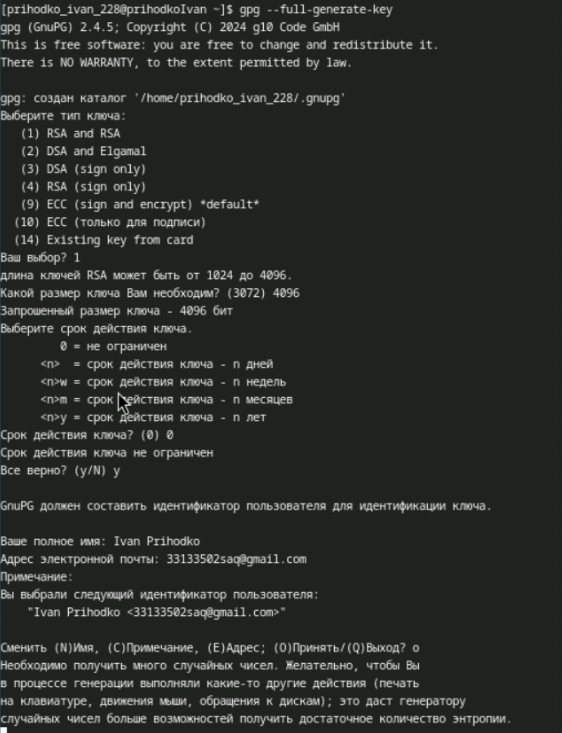{height=60%}

{height=60%}

## Создание ключа pgp

Выводим список pgp ключей

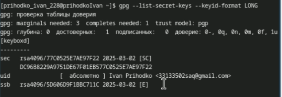{height=60%}

## Создание ключа pgp

Копирем наш ключ в буфер обмена

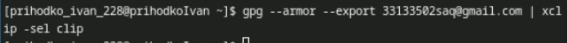{height=60%}

## Создание ключа pgp

Добавляем наш ключ на Github

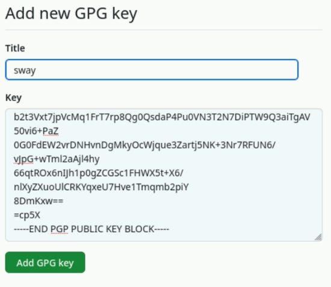{height=60%}

## Настройка автоматических подписей коммитов git

Производим найстройку автоматических подписей

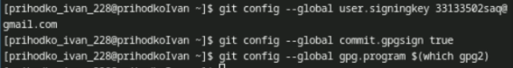{height=60%}

## Настройка gh

После этого авторизируемся на github с помощью gh, выбираем SSH протокол, публичный ключ id_rsa.pub и имя ключа sway

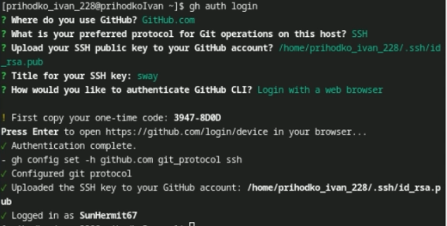{height=60%}

## Сознание репозитория курса на основе шаблона

Создаем рабочую папку

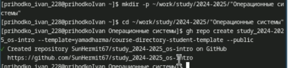{height=60%}

## Сознание репозитория курса на основе шаблона

Копируем туда репозиторий из лабораторной работы и создаем свой

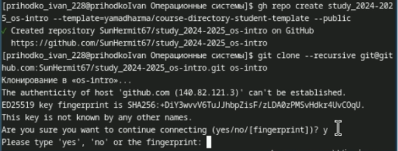{height=60%}

## Настройка каталога курса

Удаляем ненужный файлы и создаем необходимые каталоги. Прописываем make prepare

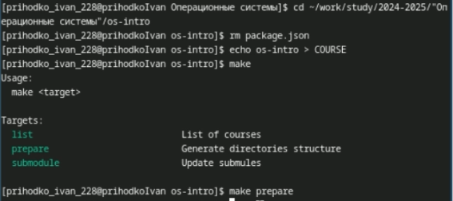{height=60%}

## Настройка каталога курса

Добавляем нашу папку для отправки, добавляем коммит и пушим!

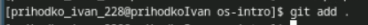{height=60%}

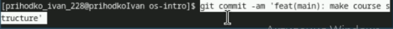{height=60%}

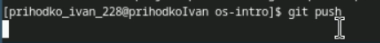{height=60%}

## Выводы

Была произведена установка git, проведена его первоначальная настройка, были созданы ключи для авторизации и подписи, а также создан репозиторий курса из предложенного шаблона
