---
## Front matter
title: "Отчёт"
subtitle: "Лабораторная работа № 2"
author: "Приходько Иван Иванович"

## Generic otions
lang: ru-RU
toc-title: "Содержание"

## Bibliography
bibliography: bib/cite.bib
csl: pandoc/csl/gost-r-7-0-5-2008-numeric.csl

## Pdf output format
toc: true # Table of contents
toc-depth: 2
lof: true # List of figures
lot: true # List of tables
fontsize: 12pt
linestretch: 1.5
papersize: a4
documentclass: scrreprt
## I18n polyglossia
polyglossia-lang:
  name: russian
  options:
	- spelling=modern
	- babelshorthands=true
polyglossia-otherlangs:
  name: english
## I18n babel
babel-lang: russian
babel-otherlangs: english
## Fonts
mainfont: IBM Plex Serif
romanfont: IBM Plex Serif
sansfont: IBM Plex Sans
monofont: IBM Plex Mono
mathfont: STIX Two Math
mainfontoptions: Ligatures=Common,Ligatures=TeX,Scale=0.94
romanfontoptions: Ligatures=Common,Ligatures=TeX,Scale=0.94
sansfontoptions: Ligatures=Common,Ligatures=TeX,Scale=MatchLowercase,Scale=0.94
monofontoptions: Scale=MatchLowercase,Scale=0.94,FakeStretch=0.9
mathfontoptions:
## Biblatex
biblatex: true
biblio-style: "gost-numeric"
biblatexoptions:
  - parentracker=true
  - backend=biber
  - hyperref=auto
  - language=auto
  - autolang=other*
  - citestyle=gost-numeric
## Pandoc-crossref LaTeX customization
figureTitle: "Рис."
tableTitle: "Таблица"
listingTitle: "Листинг"
lofTitle: "Список иллюстраций"
lotTitle: "Список таблиц"
lolTitle: "Листинги"
## Misc options
indent: true
header-includes:
  - \usepackage{indentfirst}
  - \usepackage{float} # keep figures where there are in the text
  - \floatplacement{figure}{H} # keep figures where there are in the text
---

# Цель работы

Изучить идеологию и применение средств контроля версий. Освоить умения по работе с git.

# Задание

Создать базовую конфигурацию для git.
Создать ключ SSH и PGP.
Зарегистрироваться на Github.
Создать локальный каталог для выполнения заданий поп предмету.

# Выполнение лабораторной работы

Для начала установим git (рис. [-@fig:001]).

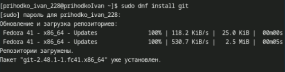{#fig:001 width=70%}

Далее установим gh (рис. [-@fig:002]).

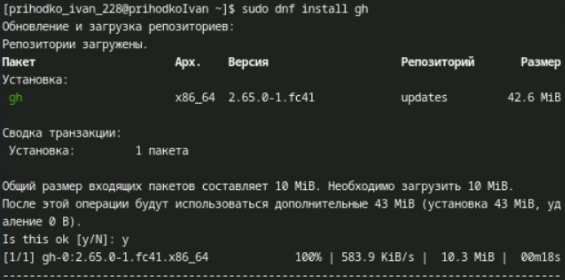{#fig:002 width=70%}

Далее зададим имя владельца репозитория и его почту (рис. [-@fig:003]).

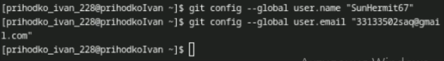{#fig:003 width=70%}

Установим имя начальной ветки, параметр autocrlf и safecrlf (рис. [-@fig:004]).

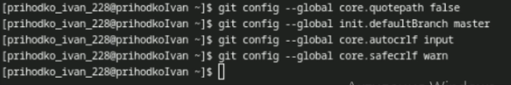{#fig:004 width=70%}

Создадим RSA ключ размером 4096 (рис. [-@fig:005]).

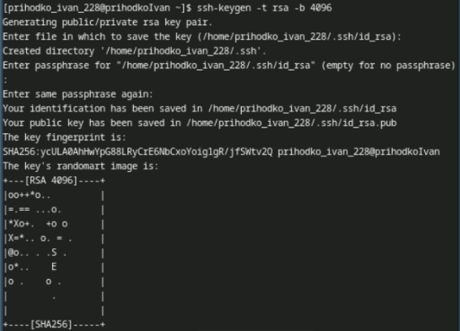{#fig:005 width=70%}

Далее создадим ключ по алгоритму ed25519 (рис. [-@fig:006]).

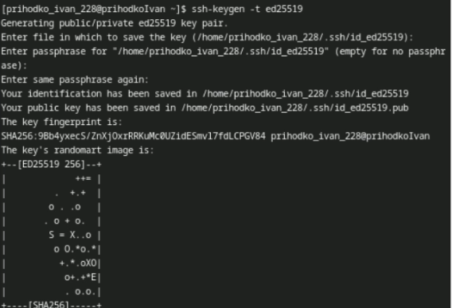{#fig:006 width=70%}

Создадим PGP ключ. Выбираем тип «RSA and RSA», на 4096 бит и срок неограничен. Далее вводим свои данные и генерируем ключ (рис. [-@fig:007], [-@fig:008]).

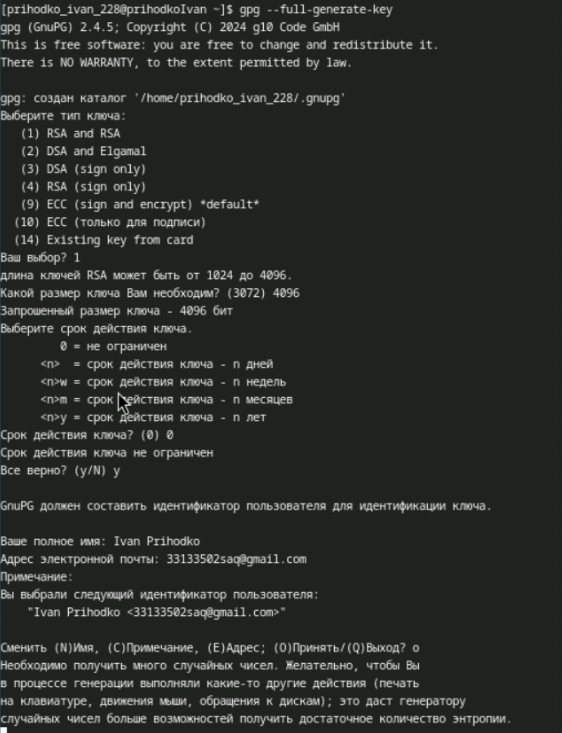{#fig:007 width=70%}

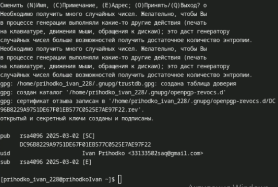{#fig:008 width=70%}

Выводим список pgp ключей (рис. [-@fig:009]).

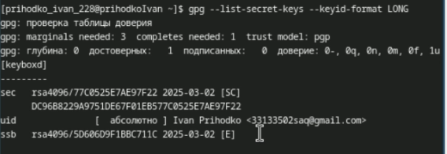{#fig:009 width=70%}

Копирем наш ключ в буфер обмена (рис. [-@fig:010]).

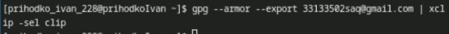{#fig:010 width=70%}

Добавляем наш ключ на Github (рис. [-@fig:011]).

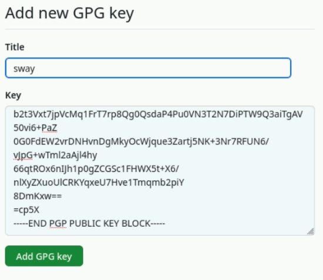{#fig:011 width=70%}

Производим найстройку автоматических подписей (рис. [-@fig:012]).

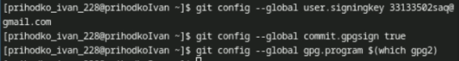{#fig:012 width=70%}

После этого авторизируемся на github с помощью gh, выбираем SSH протокол, публичный ключ id_rsa.pub и имя ключа sway (рис. [-@fig:013]).

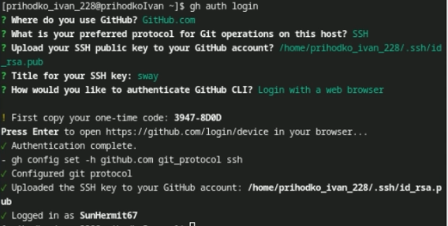{#fig:013 width=70%}

Создаем рабочую папку (рис. [-@fig:014]).

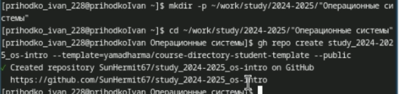{#fig:014 width=70%}

Копируем туда репозиторий из лабораторной работы и создаем свой (рис. [-@fig:015]).

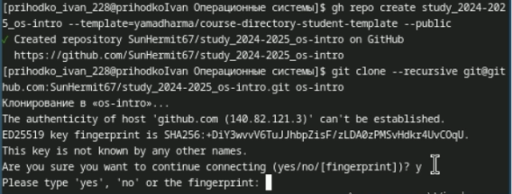{#fig:015 width=70%}

Удаляем ненужный файлы и создаем необходимые каталоги. Прописываем make prepare (рис. [-@fig:016]).

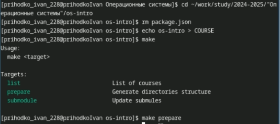{#fig:016 width=70%}

Добавляем нашу папку для отправки, добавляем коммит и пушим! (рис. [-@fig:017]-[-@fig:019])

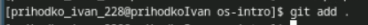{#fig:017 width=70%}

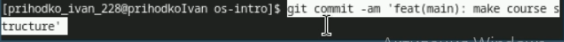{#fig:018 width=70%}

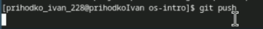{#fig:019 width=70%}

# Выводы

Была произведена установка git, проведена его первоначальная настройка, были созданы ключи для авторизации и подписи, а также создан репозиторий курса из предложенного шаблона

# Ответы на контрольные вопросы

1. Системы контроля версий – это системы, в которых мы можем хранить свои проекты и выкладывать их обновления, контролируя релизы и каждые внесённые изменения. Эти системы нужны для работы над проектами, чтобы иметь возможность контролировать версии проектов и в случае командной работы контролировать изменения, внесённые всеми участниками. Также, VCS позволяют откатываться на более ранние версии
2. Хранилище – репозиторий, в нём хранятся все файлы проекта и все его версии  
commit – внесённые изменения в репозитории  
история – это история изменений файлов проекта  
рабочая копия – копия, сделанная из версии репозитория, с которой непосредственно работает сам разработчик
3. Централизованные системы контроля версий имеют один центральный репозиторий, с которым работают все разработчики. Примером является CVS, который является уже устаревшей системой.   
В децентрализованных системах же используется множество репозиториев одного проекта у каждого из разработчиков, при этом репозитории можно объединять брать из каждого только то, что нужно. Примером является знакомый нам Git
4. Создаётся репозиторий, и разрабатывается проект. При внесении изменений файлы отправляются на сервер
5. Разработчик клонирует репозиторий к себе на компьютер, и после внесения изменений выгружает их на сервер в качестве отдельной версии. После этого разработчики с более высокими правами могут, например, объединить его версию с текущей
6. Хранение файлов проекта, а также обеспечение командной работы, и контроль за версиями проекта
7. git clone – клонирует проект с сервера на компьютер  
git add – добавляет папку для выгрузки на сервер  
git commit – фиксирует изменения репозитория  
git push – выгружает изменения на сервер  
git pull – получить изменения с сервера  
git rm – удалить файл  
git status – получить статус репозитория
8. С локальным: git commit -am “added files” – создаёт коммит
С удалённым: git push – загрузить данные на удалённый сервер
9. Ветки – это несколько независимых копий проекта, в каждой из которых ведётся разработка какой-то конкретной функции, при этом ветки существуют параллельно. Они нужны, когда нужно параллельно вести разработку нескольких функций, а в конце их можно объединить в одну
10. Игнорировать файлы можно, внося их в файл .gitignore. Игнорировать файлы нужно, когда их не нужно добавлять в репозиторий. Например, это могут быть файлы виртуального окружения (venv)
