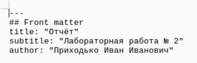
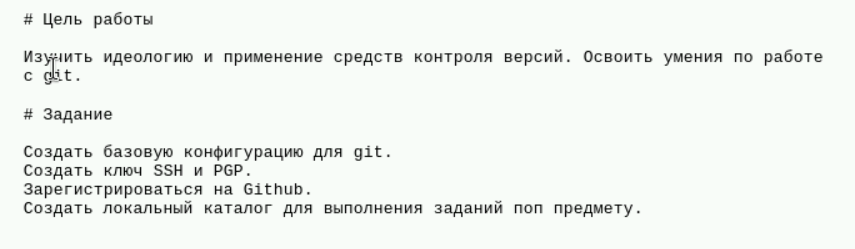
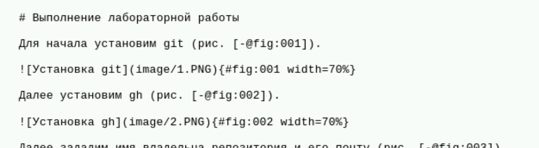
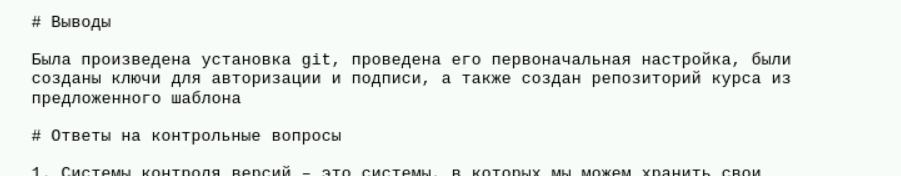

---
## Front matter
lang: ru-RU
title: Лабораторная работа №3
subtitle: Презентация
author:
  - Приходько И. И.
institute:
  - Российский университет дружбы народов, Москва, Россия

## i18n babel
babel-lang: russian
babel-otherlangs: english

## Formatting pdf
toc: false
toc-title: Содержание
slide_level: 2
aspectratio: 169
section-titles: true
theme: metropolis
header-includes:
 - \metroset{progressbar=frametitle,sectionpage=progressbar,numbering=fraction}
---

# Информация

## Докладчик

::::::::::::::: {.columns align=center}
::: {.column width="70%"}

  * Приходько иван Иванович
  * Студент
  * Российский университет дружбы народов
  * [1132246285@pfur.ru](mailto:1132246285@pfur.ru)

:::
::: {.column width="30%"}

:::
::::::::::::::

## Цель работы

Научится работать с языком разметки Markdown.

## Задание

Оформить отчет второй лабораторной работы в языке разметки Markdown.

## Написание титульного листа

Создаем титульный лист

{height=60%}

## Написание цели и задач

Заполняем цель работы и задание

{height=60%}

## Написание раздела "Выполнение лабораторной работы"

Дальше копируем текст и выбираем правильные картинки

{height=60%}

## Написание вывода

Заполняем вывод

{height=60%}

## Выводы

В ходе данной лабораторной работы были получены знания для работы с языком разметки Markdown.
