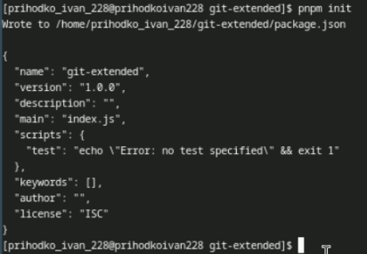

---
## Front matter
lang: ru-RU
title: Лабораторная работа №4
subtitle: Презентация
author:
  - Приходько И. И.
institute:
  - Российский университет дружбы народов, Москва, Россия

## i18n babel
babel-lang: russian
babel-otherlangs: english

## Formatting pdf
toc: false
toc-title: Содержание
slide_level: 2
aspectratio: 169
section-titles: true
theme: metropolis
header-includes:
 - \metroset{progressbar=frametitle,sectionpage=progressbar,numbering=fraction}
---

# Информация

## Докладчик

:::::::::::::: {.columns align=center}
::: {.column width="70%"}

  * Приходько Иван Иванович
  * Студент
  * Российский университет дружбы народов
  * [1132246285@pfur.ru](mailto:1132246285@pfur.ru)

:::
::: {.column width="30%"}

:::
::::::::::::::

## Цель

Получение навыков работы с репоззиториями git.

## Задание

Выполнить работы с тестовым репозиторием, преобраазовать его в репозиторий с git-flow.

## Установка ПО

Для начала подключаем репозиторий, из которого скачаем gitflow

{height=50%}

## Установка ПО

Устанавливаем gitflow

{height=50%}

## Установка ПО

Устанавливаем nodejs

{height=50%}

## Установка ПО

Устанавливаем pnpm

{height=50%}

## Установка ПО

Запускаем pnpm

{height=50%}

## Установка ПО

Установим с помощью него commitizen и changelog

{height=50%}

## Настройка репозитория

Создадим репозиторий git-extended

{height=50%}

## Настройка репозитория

Создадим тестовый файл

{height=50%}

## Настройка репозитория

Добавим первый коомит и добавим ветку

{height=50%}

## Продвинутое создание коммитов

Проинициализируем pnpm

{height=50%}

## Продвинутое создание коммитов

Добавим необходимую информацию в только что созданный файл package.json

{height=50%}

## Продвинутое создание коммитов

Сделаем коммит через cz и запушим

{height=50%}

## Использование gitflow

Проинициализируем gitflow и убедимся ,что мы на ветке develop

{height=50%}

## Использование gitflow

Запушим

{height=50%}

## Работа с релизами

Добавим ветку релиза 1.0.0

{height=50%}

## Работа с релизами

Завершим первый релиз

{height=50%}

## Работа с релизами

Запушим все файлы с тэгами

{height=50%}

## Работа с релизами

Создадим первый changelog

{height=50%}

## Работа с релизами

Начнем релиз 1.2.3

{height=50%}

## Работа с релизами

Изменим package.json

{height=50%}

## Работа с релизами

Добавляем новый changelog и коммит

{height=50%}

## Работа с релизами

Пушим

{height=50%}

## Выводы

В результате выполнение данной работы были получены навыки работы с расширенными возможностями git.
