---
## Front matter
title: "Лабораторная работа № 4"
subtitle: "Отчёт"
author: "Приходько Иван Иванович"

## Generic otions
lang: ru-RU
toc-title: "Содержание"

## Bibliography
bibliography: bib/cite.bib
csl: pandoc/csl/gost-r-7-0-5-2008-numeric.csl

## Pdf output format
toc: true # Table of contents
toc-depth: 2
lof: true # List of figures
lot: true # List of tables
fontsize: 12pt
linestretch: 1.5
papersize: a4
documentclass: scrreprt
## I18n polyglossia
polyglossia-lang:
  name: russian
  options:
	- spelling=modern
	- babelshorthands=true
polyglossia-otherlangs:
  name: english
## I18n babel
babel-lang: russian
babel-otherlangs: english
## Fonts
mainfont: IBM Plex Serif
romanfont: IBM Plex Serif
sansfont: IBM Plex Sans
monofont: IBM Plex Mono
mathfont: STIX Two Math
mainfontoptions: Ligatures=Common,Ligatures=TeX,Scale=0.94
romanfontoptions: Ligatures=Common,Ligatures=TeX,Scale=0.94
sansfontoptions: Ligatures=Common,Ligatures=TeX,Scale=MatchLowercase,Scale=0.94
monofontoptions: Scale=MatchLowercase,Scale=0.94,FakeStretch=0.9
mathfontoptions:
## Biblatex
biblatex: true
biblio-style: "gost-numeric"
biblatexoptions:
  - parentracker=true
  - backend=biber
  - hyperref=auto
  - language=auto
  - autolang=other*
  - citestyle=gost-numeric
## Pandoc-crossref LaTeX customization
figureTitle: "Рис."
tableTitle: "Таблица"
listingTitle: "Листинг"
lofTitle: "Список иллюстраций"
lotTitle: "Список таблиц"
lolTitle: "Листинги"
## Misc options
indent: true
header-includes:
  - \usepackage{indentfirst}
  - \usepackage{float} # keep figures where there are in the text
  - \floatplacement{figure}{H} # keep figures where there are in the text
---

# Цель работы

Получение навыков работы с репоззиториями git.

# Задание

Выполнить работы с тестовым репозиторием, преобраазовать его в репозиторий с git-flow.

# Выполнение лабораторной работы

Для начала подключаем репозиторий, из которого скачаем gitflow (рис. [-@fig:001]).

{#fig:001 width=70%}

Устанавливаем gitflow (рис. [-@fig:003]).

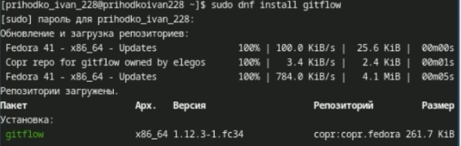{#fig:003 width=70%}

Устанавливаем nodejs (рис. [-@fig:004]).

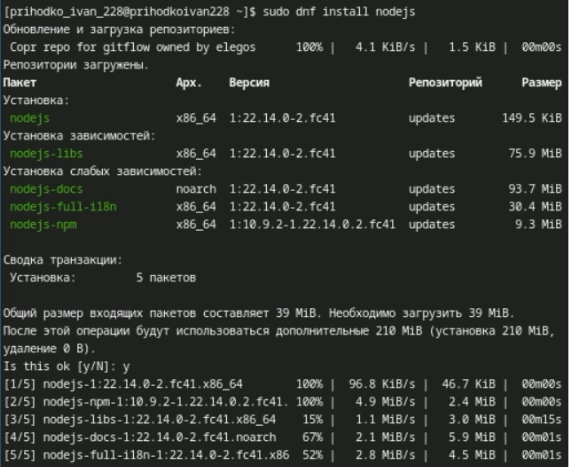{#fig:004 width=70%}

Устанавливаем pnpm (рис. [-@fig:005]).

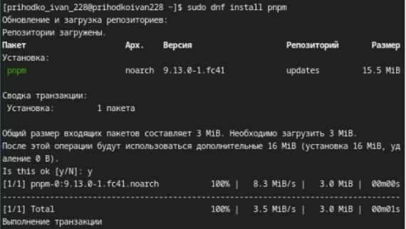{#fig:005 width=70%}

Запускаем pnpm (рис. [-@fig:006]).

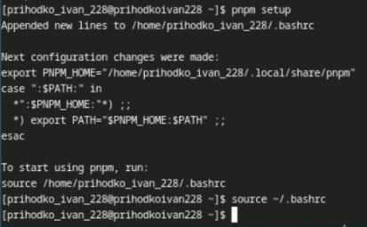{#fig:006 width=70%}

Установим с помощью него commitizen и changelog(рис. [-@fig:007]).

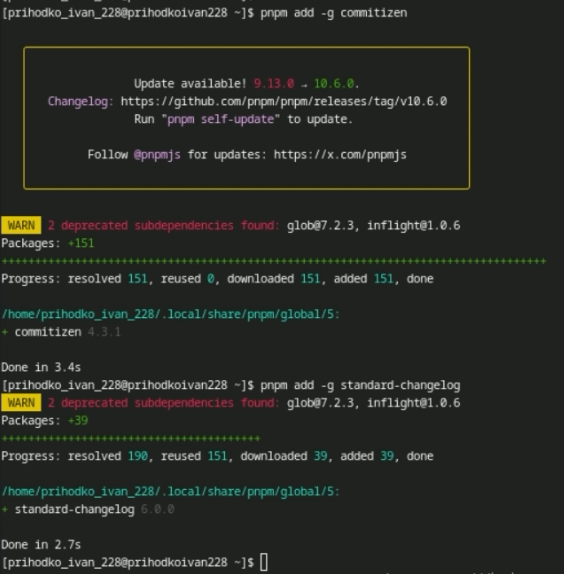{#fig:007 width=70%}

Создадим репозиторий git-extended (рис. [-@fig:008]).

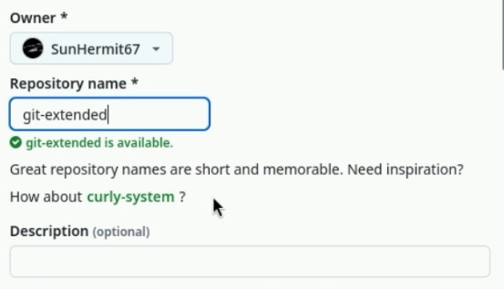{#fig:008 width=70%}

Создадим тестовый файл (рис. [-@fig:009]).

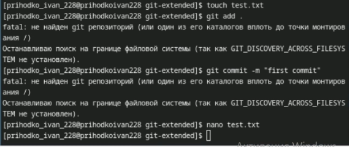{#fig:009 width=70%}

Добавим первый коомит и добавим ветку (рис. [-@fig:010]).

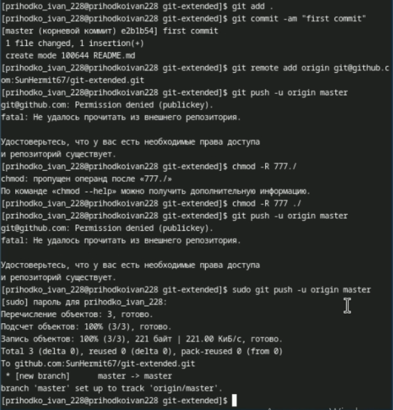{#fig:010 width=70%}

Проинициализируем pnpm (рис. [-@fig:011]).

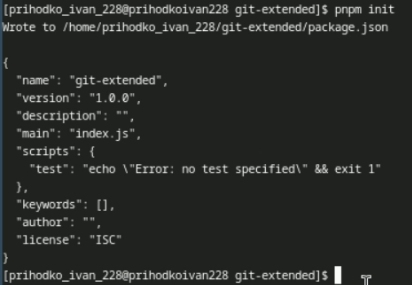{#fig:011 width=70%}

Добавим необходимую информацию в только что созданный файл package.json (рис. [-@fig:012]).

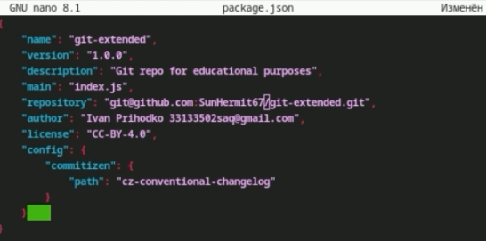{#fig:012 width=70%}

Сделаем коммит через cz и запушим (рис. [-@fig:013]).

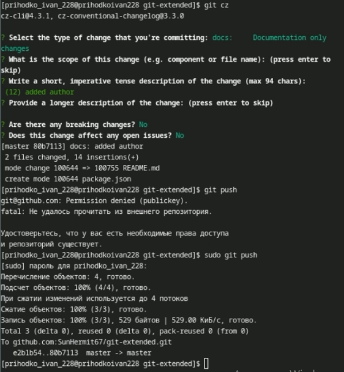{#fig:013 width=70%}

Проинициализируем gitflow и убедимся ,что мы на ветке develop (рис. [-@fig:014]).

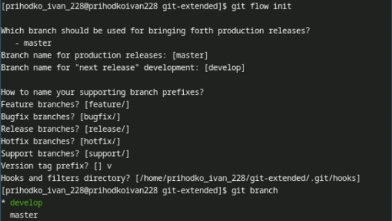{#fig:014 width=70%}

Запушим (рис. [-@fig:015]).

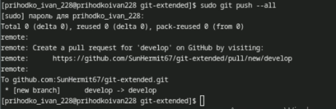{#fig:015 width=70%}

Добавим ветку релиза 1.0.0 (рис. [-@fig:016]).

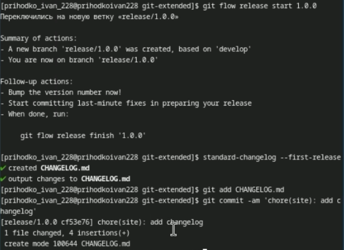{#fig:016 width=70%}

Завершим первый релиз (рис. [-@fig:017]).

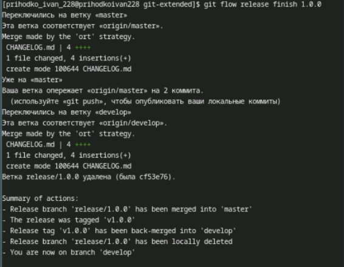{#fig:017 width=70%}

Запушим все файлы с тэгами (рис. [-@fig:018]).

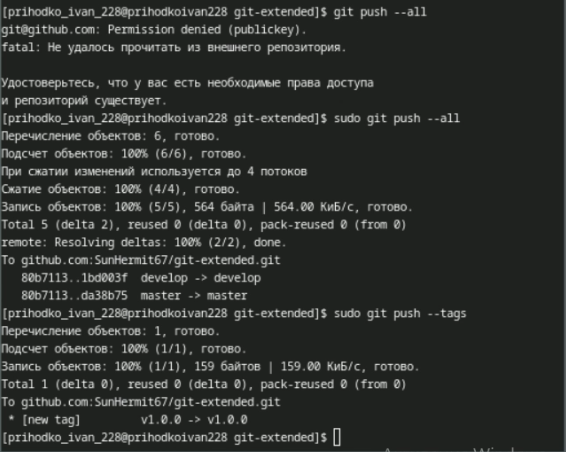{#fig:018 width=70%}

Создадим первый changelog (рис. [-@fig:019]).

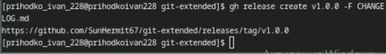{#fig:019 width=70%}

Начнем релиз 1.2.3 (рис. [-@fig:020]).

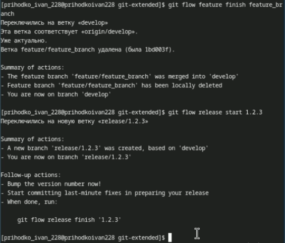{#fig:020 width=70%}

Изменим package.json (рис. [-@fig:021]).

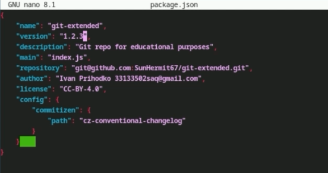{#fig:021 width=70%}

Добавляем новый changelog и коммит (рис. [-@fig:022]).

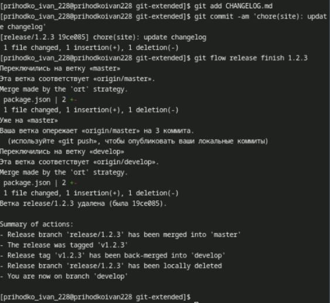{#fig:022 width=70%}

Пушим (рис. [-@fig:023]).

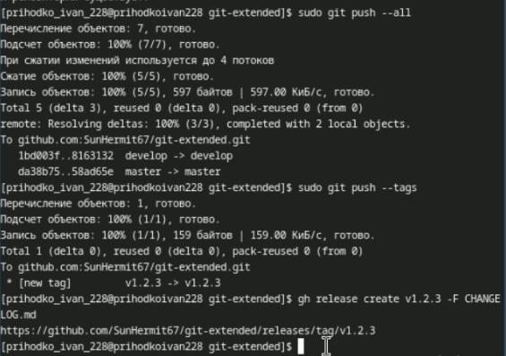{#fig:023 width=70%}

# Выводы

В результате выполнение данной работы были получены навыки работы с расширенными возможностями git.
