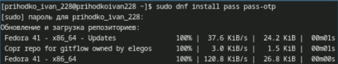
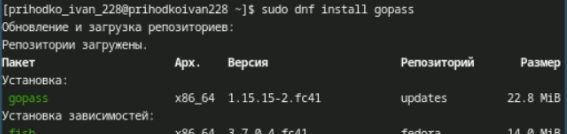
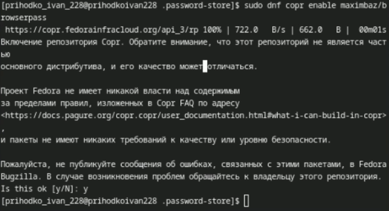
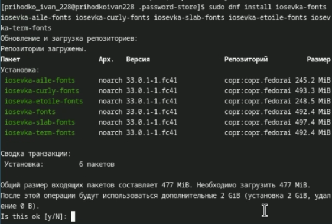
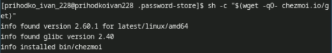
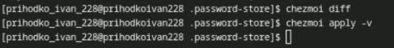

---
## Front matter
lang: ru-RU
title: Лабораторная работа №5
subtitle: Презентация
author:
  - Приходько И. И.
institute:
  - Российский университет дружбы народов, Москва, Россия

## i18n babel
babel-lang: russian
babel-otherlangs: english

## Formatting pdf
toc: false
toc-title: Содержание
slide_level: 2
aspectratio: 169
section-titles: true
theme: metropolis
header-includes:
 - \metroset{progressbar=frametitle,sectionpage=progressbar,numbering=fraction}
---

# Информация

## Докладчик

:::::::::::::: {.columns align=center}
::: {.column width="70%"}

  * Приходько Иван Иванович
  * Студент
  * Российский университет дружбы народов
  * [1132246285@pfur.ru](mailto:1132246285@pfur.ru)

:::
::: {.column width="30%"}

:::
::::::::::::::

## Цель

Научиться пользоваться pass и chezmoi

## Задачи

Настроить ОС, синхронизируя её с данной.  
Научиться использовать программы для управления паролями 

## Установка программ

Установим pass 

{height=60%}

## Установка программ

Установим gopass  

 {height=60%}

## Работа с pass

Выведем pgp ключи  

 {height=60%}

## Работа с pass

У меня его не оказалось, поэтому я создал новый, проиннициализируем pass 

 {height=60%}

## Работа с pass

Проинициализируем репозиторий git для pass  

 {height=60%}

## Работа с pass

Создадим новый репозиторий  

 {height=60%}

## Работа с pass

Настраиваем репозиторий  

 {height=60%}

## Работа с pass

Сделаем пустой коммит  

 {height=60%}

## Работа с pass

Запушим  

 {height=60%}

## Работа с pass

Установим browserpass для firefox  

 {height=60%}

## Работа с pass

Установим browserpass для системы  

 {height=60%}

 {height=60%}

## Работа с pass

Создадим пустой текстовый файл и дадим ему пароль  

 {height=60%}

## Работа с Chezmoi

Установим необходимое обеспечение 

 {height=60%}

## Работа с Chezmoi

Установм необходимые шрифты  

 {height=60%}

## Работа с Chezmoi

Установим chezmoi 

 {height=60%}

## Работа с Chezmoi

Создадим репозиторий из шаблона  

 {height=60%}

## Работа с Chezmoi

Проинициализируем его с chezmoi 

 {height=60%}

## Работа с Chezmoi

Настроим репозиторий  

 {height=60%}

## Работа с Chezmoi

Проверим обновления  

 {height=60%}

## Работа с Chezmoi

Подключим авто обновления 

 {height=60%}

## Работа с Chezmoi

Примим изменения 

 {height=60%}

## Работа с Chezmoi

Изменим конфигурационный файл, чтобы включить автообновления 

 {height=60%}

## Выводы

В результате выполнения лабораторной работы были получены знания, для работы с программой для управление паролей, и навык синхронзации ОС.
