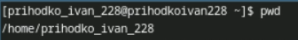
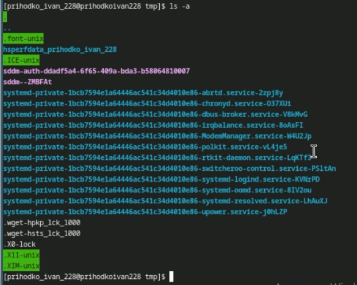
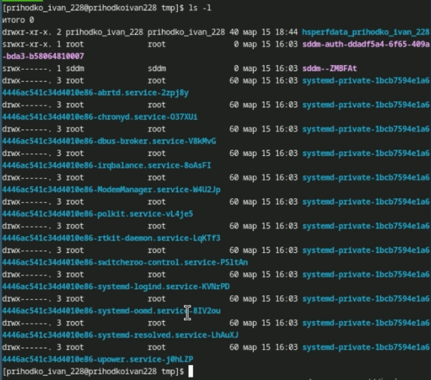
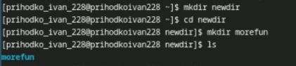
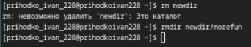
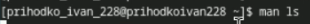
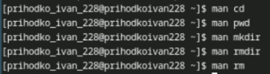

---
## Front matter
lang: ru-RU
title: Лабораторная работа №6
subtitle: Презентация
author:
  - Приходько И. И.
institute:
  - Российский университет дружбы народов, Москва, Россия

## i18n babel
babel-lang: russian
babel-otherlangs: english

## Formatting pdf
toc: false
toc-title: Содержание
slide_level: 2
aspectratio: 169
section-titles: true
theme: metropolis
header-includes:
 - \metroset{progressbar=frametitle,sectionpage=progressbar,numbering=fraction}
---

# Информация

## Докладчик

:::::::::::::: {.columns align=center}
::: {.column width="70%"}

  * Приходько Иван Иванович
  * Студент
  * Российский университет дружбы народов
  * [1132246285@pfur.ru](mailto:11ы32246285@pfur.ru)

:::
::: {.column width="30%"}

:::
::::::::::::::

# Цель работы

Приобретение навыко взаимодействия с командной строкой

## Задание

1. Определите полное имя вашего домашнего каталога. Далее относительно этого ката-
лога будут выполняться последующие упражнения.
2. Выполните следующие действия:
2.1. Перейдите в каталог /tmp.
2.2. Выведите на экран содержимое каталога /tmp. Для этого используйте команду ls
с различными опциями. Поясните разницу в выводимой на экран информации.
2.3. Определите, есть ли в каталоге /var/spool подкаталог с именем cron?
2.4. Перейдите в Ваш домашний каталог и выведите на экран его содержимое. Опре-
делите, кто является владельцем файлов и подкаталогов?
3. Выполните следующие действия:
3.1. В домашнем каталоге создайте новый каталог с именем newdir.
3.2. В каталоге ~/newdir создайте новый каталог с именем morefun.
3.3. В домашнем каталоге создайте одной командой три новых каталога с именами
letters, memos, misk. Затем удалите эти каталоги одной командой.
3.4. Попробуйте удалить ранее созданный каталог ~/newdir командой rm. Проверьте,
был ли каталог удалён.
3.5. Удалите каталог ~/newdir/morefun из домашнего каталога. Проверьте, был ли
каталог удалён.
4. С помощью команды man определите, какую опцию команды ls нужно использо-
вать для просмотра содержимое не только указанного каталога, но и подкаталогов,
входящих в него.
5. С помощью команды man определите набор опций команды ls, позволяющий отсорти-
ровать по времени последнего изменения выводимый список содержимого каталога
с развёрнутым описанием файлов.
6. Используйте команду man для просмотра описания следующих команд: cd, pwd, mkdir,
rmdir, rm. Поясните основные опции этих команд.
7. Используя информацию, полученную при помощи команды history, выполните мо-
дификацию и исполнение нескольких команд из буфера команд.

## ls

Посмотрим полный путь до нашего каталога

## ls

С помощью различных ключей выведем информацию о файлах

## ls

Проверим есть ли в каталоге spool каталог cron

## ls

Выведем подробную информацию о файлах в домашнем каталоге 

## ls

Создадим несколько каталогов и поэкспериментируем с этим

## man

Воспользуемся командой man, чтобы узнать информацию о команде ls

## man

Найдем нужные нам ключи

## man

Аналогично посмотрим описание других команд

## history

Попробуем заменить команду из прошлой строчки

## Выводы

В результате выполнения данной работы были получены знания для работы с командной строкой
