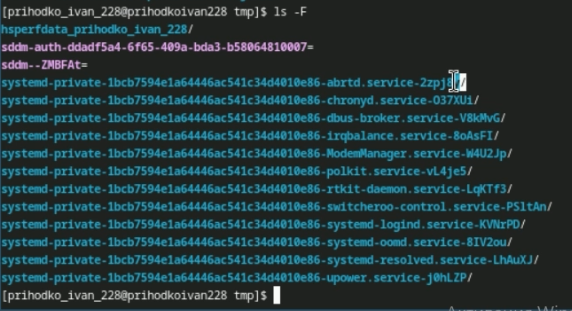
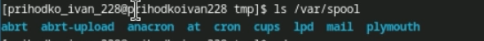
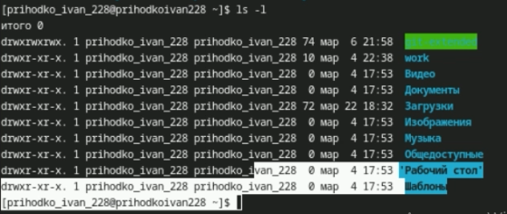
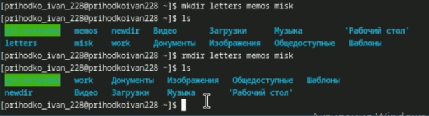
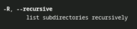
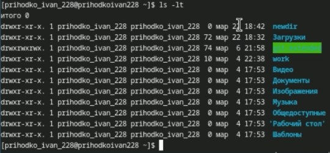
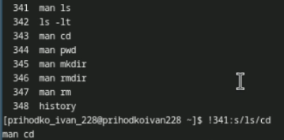

---
## Front matter
title: "Лабораторная работа №6"
subtitle: "Отчёт"
author: "Приходько Иван Иваноич"

## Generic otions
lang: ru-RU
toc-title: "Содержание"

## Bibliography
bibliography: bib/cite.bib
csl: pandoc/csl/gost-r-7-0-5-2008-numeric.csl

## Pdf output format
toc: true # Table of contents
toc-depth: 2
lof: true # List of figures
lot: true # List of tables
fontsize: 12pt
linestretch: 1.5
papersize: a4
documentclass: scrreprt
## I18n polyglossia
polyglossia-lang:
  name: russian
  options:
	- spelling=modern
	- babelshorthands=true
polyglossia-otherlangs:
  name: english
## I18n babel
babel-lang: russian
babel-otherlangs: english
## Fonts
mainfont: IBM Plex Serif
romanfont: IBM Plex Serif
sansfont: IBM Plex Sans
monofont: IBM Plex Mono
mathfont: STIX Two Math
mainfontoptions: Ligatures=Common,Ligatures=TeX,Scale=0.94
romanfontoptions: Ligatures=Common,Ligatures=TeX,Scale=0.94
sansfontoptions: Ligatures=Common,Ligatures=TeX,Scale=MatchLowercase,Scale=0.94
monofontoptions: Scale=MatchLowercase,Scale=0.94,FakeStretch=0.9
mathfontoptions:
## Biblatex
biblatex: true
biblio-style: "gost-numeric"
biblatexoptions:
  - parentracker=true
  - backend=biber
  - hyperref=auto
  - language=auto
  - autolang=other*
  - citestyle=gost-numeric
## Pandoc-crossref LaTeX customization
figureTitle: "Рис."
tableTitle: "Таблица"
listingTitle: "Листинг"
lofTitle: "Список иллюстраций"
lotTitle: "Список таблиц"
lolTitle: "Листинги"
## Misc options
indent: true
header-includes:
  - \usepackage{indentfirst}
  - \usepackage{float} # keep figures where there are in the text
  - \floatplacement{figure}{H} # keep figures where there are in the text
---

# Цель работы

Приобретение навыко взаимодействия с командной строкой

# Задание

1. Определите полное имя вашего домашнего каталога. Далее относительно этого ката-
лога будут выполняться последующие упражнения.
2. Выполните следующие действия:
2.1. Перейдите в каталог /tmp.
2.2. Выведите на экран содержимое каталога /tmp. Для этого используйте команду ls
с различными опциями. Поясните разницу в выводимой на экран информации.
2.3. Определите, есть ли в каталоге /var/spool подкаталог с именем cron?
2.4. Перейдите в Ваш домашний каталог и выведите на экран его содержимое. Опре-
делите, кто является владельцем файлов и подкаталогов?
3. Выполните следующие действия:
3.1. В домашнем каталоге создайте новый каталог с именем newdir.
3.2. В каталоге ~/newdir создайте новый каталог с именем morefun.
3.3. В домашнем каталоге создайте одной командой три новых каталога с именами
letters, memos, misk. Затем удалите эти каталоги одной командой.
3.4. Попробуйте удалить ранее созданный каталог ~/newdir командой rm. Проверьте,
был ли каталог удалён.
3.5. Удалите каталог ~/newdir/morefun из домашнего каталога. Проверьте, был ли
каталог удалён.
4. С помощью команды man определите, какую опцию команды ls нужно использо-
вать для просмотра содержимое не только указанного каталога, но и подкаталогов,
входящих в него.
5. С помощью команды man определите набор опций команды ls, позволяющий отсорти-
ровать по времени последнего изменения выводимый список содержимого каталога
с развёрнутым описанием файлов.
6. Используйте команду man для просмотра описания следующих команд: cd, pwd, mkdir,
rmdir, rm. Поясните основные опции этих команд.
7. Используя информацию, полученную при помощи команды history, выполните мо-
дификацию и исполнение нескольких команд из буфера команд.

# Выполнение лабораторной работы

Посмотрим полный путь до нашего каталога (рис. [-@fig:001]).

{#fig:001 width=70%}

С помощью различных ключей выведем информацию о файлах (рис. [-@fig:002] - [-@fig:004]).

{#fig:002 width=70%}

{#fig:003 width=70%}

{#fig:004 width=70%}

Проверим есть ли в каталоге spool каталог cron (рис. [-@fig:005]).

{#fig:005 width=70%}

Выведем подробную информацию о файлах в домашнем каталоге (рис. [-@fig:006]).

{#fig:006 width=70%}

Создадим несколько каталогов и поэкспериментируем с этим (рис. [-@fig:007] - [-@fig:009]).

{#fig:007 width=70%}

{#fig:008 width=70%}

{#fig:009 width=70%}

Воспользуемся командой man, чтобы узнать информацию о команде ls (рис. [-@fig:010]).

{#fig:010 width=70%}

Найдем нужные нам ключи  (рис. [-@fig:011] - [-@fig:013]).

{#fig:011 width=70%}

{#fig:012 width=70%}

{#fig:013 width=70%}

Аналогично посмотрим описание других команд (рис. [-@fig:014]).

{#fig:014 width=70%}

Попробуем заменить команду из прошлой строчки (рис. [-@fig:015]).

{#fig:015 width=70%}

# Выводы

В результате выполнения данной работы были получены знания для работы с командной строкой

# Ответы на контрольные вопросы

1. Строка, в которую мы можем писать команды для исполнения  
2. С помощью pwd. Например: pwd Загрузки
3. С помощью ls -F. Например: ls -F /tmp
4. С помощью ls -al. Например: ls -al /var
5. При помощи rm и rmdir соответственно. С помощью rm -R можно удалить как файл, так и каталог. Например: rm -R git-extended
6. С помощью history. Например, history
7. !<номер_команды>:s/<что_меняем>/<на_что_меняем>. Например, !3:s/a/F
8. cd; mkdir newdir; rm file.txt
9. Символы экранирования - специальные символы, которые интерпретируются по другому. Например, !3:s/-a/\/newdir
10. Выводит также владельца, дату, права доступа и название
11. Относительный путь - путь относительно текущего нахождения. Например, cd tmp и cd /tmp - разные по значению команды
12. С помощью man
13. tab

