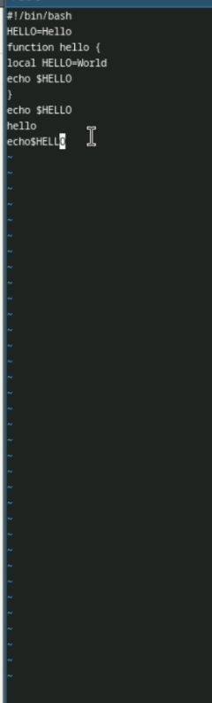

---
## Front matter
title: "Лабораторная работа №10"
subtitle: "Отчёт"
author: "Приходько Иван Иванович"

## Generic otions
lang: ru-RU
toc-title: "Содержание"

## Bibliography
bibliography: bib/cite.bib
csl: pandoc/csl/gost-r-7-0-5-2008-numeric.csl

## Pdf output format
toc: true # Table of contents
toc-depth: 2
lof: true # List of figures
lot: true # List of tables
fontsize: 12pt
linestretch: 1.5
papersize: a4
documentclass: scrreprt
## I18n polyglossia
polyglossia-lang:
  name: russian
  options:
	- spelling=modern
	- babelshorthands=true
polyglossia-otherlangs:
  name: english
## I18n babel
babel-lang: russian
babel-otherlangs: english
## Fonts
mainfont: IBM Plex Serif
romanfont: IBM Plex Serif
sansfont: IBM Plex Sans
monofont: IBM Plex Mono
mathfont: STIX Two Math
mainfontoptions: Ligatures=Common,Ligatures=TeX,Scale=0.94
romanfontoptions: Ligatures=Common,Ligatures=TeX,Scale=0.94
sansfontoptions: Ligatures=Common,Ligatures=TeX,Scale=MatchLowercase,Scale=0.94
monofontoptions: Scale=MatchLowercase,Scale=0.94,FakeStretch=0.9
mathfontoptions:
## Biblatex
biblatex: true
biblio-style: "gost-numeric"
biblatexoptions:
  - parentracker=true
  - backend=biber
  - hyperref=auto
  - language=auto
  - autolang=other*
  - citestyle=gost-numeric
## Pandoc-crossref LaTeX customization
figureTitle: "Рис."
tableTitle: "Таблица"
listingTitle: "Листинг"
lofTitle: "Список иллюстраций"
lotTitle: "Список таблиц"
lolTitle: "Листинги"
## Misc options
indent: true
header-includes:
  - \usepackage{indentfirst}
  - \usepackage{float} # keep figures where there are in the text
  - \floatplacement{figure}{H} # keep figures where there are in the text
---

# Цель работы

Работа с текстовым редактором vi

# Задание

1. Создайте каталог с именем ~/work/os/lab06.
2. Перейдите во вновь созданный каталог.
3. Вызовите vi и создайте файл hello.sh
1
vi hello.sh
4. Нажмите клавишу i и вводите следующий текст.
1
2
3
4
5
6
7
8
#!/bin/bash
HELL=Hello
function hello {
LOCAL HELLO=World
echo $HELLO
}
echo $HELLO
hello
5. Нажмите клавишу Esc для перехода в командный режим после завершения ввода
текста.
6. Нажмите : для перехода в режим последней строки и внизу вашего экрана появится
приглашение в виде двоеточия.
7. Нажмите w (записать) и q (выйти), а затем нажмите клавишу Enter для сохранения
вашего текста и завершения работы.
8. Сделайте файл исполняемым
1
chmod +x hello.sh74

1. Вызовите vi на редактирование файла
1
vi ~/work/os/lab06/hello.sh
2. Установите курсор в конец слова HELL второй строки.
3. Перейдите в режим вставки и замените на HELLO. Нажмите Esc для возврата в команд-
ный режим.
4. Установите курсор на четвертую строку и сотрите слово LOCAL.
5. Перейдите в режим вставки и наберите следующий текст: local, нажмите Esc для
возврата в командный режим.
6. Установите курсор на последней строке файла. Вставьте после неё строку, содержащую
следующий текст: echo $HELLO.
7. Нажмите Esc для перехода в командный режим.
8. Удалите последнюю строку.
9. Введите команду отмены изменений u для отмены последней команды.
10. Введите символ : для перехода в режим последней строки. Запишите произведённые
изменения и выйдите из vi.

# Выполнение лабораторной работы

Для начала откроем текстовый редактор (рис. [-@fig:001]).

{#fig:001 width=70%}

Далее мы немного поработали с горячими клавишами в меню текстового редактора (рис. [-@fig:002]-[-@fig:003]).

{#fig:002 width=70%}

{#fig:003 width=70%}

# Выводы

В ходе данной лабораторной работы были получены знания для работы с текстовым редактором vi

# Ответы на контрольные вопросы
1. Режим команд - служит для ввода команд редактирования и перемещения по редактируемому файлу.  
Режим вставки - предназначен для добавления текста в редактируемый файл.  
Режим командной строки (или последней строки) - используется для сохранения внесенных изменений в файл и выхода из редактора.  
2. Если вам нужно выйти из редактора без сохранения, вы можете просто нажать клавишу "q" (или "q!").  
3. "0" (ноль) — перемещение к началу текущей строки  
"$" — перемещение к концу текущей строки  
"G" — перемещение к концу файла  
"n G" — перемещение к строке с номером n  
4. Редактор vi определяет слово как последовательность символов, состоящую из букв, цифр и символов подчеркивания.  
5. С помощью команды "G" вы перемещаетесь в конец файла в редакторе vi.  
6. Вставка текста:  
"а" - вставить текст после текущего курсора;  
"А" - вставить текст в конец текущей строки;  
"i" - вставить текст перед текущим курсором;  
"n i" - вставить текст n раз;  
"I" - вставить текст в начало текущей строки.  
Вставка строки:  
"о" - вставить строку под текущим курсором;  
"О" - вставить строку над текущим курсором.  
Удаление текста:  
"x" - удалить один символ и поместить его в буфер обмена;  
"d w" - удалить одно слово и поместить его в буфер обмена;  
"d $" - удалить текст от текущего курсора до конца строки и поместить его в буфер обмена;  
"d 0" - удалить текст от начала строки до текущего курсора и поместить его в буфер обмена;  
"d d" - удалить текущую строку и поместить её в буфер обмена;  
"n d d" - удалить n строк и поместить их в буфер обмена.
Отмена и повтор изменений:  
"u" - отменить последнее изменение;  
"." - повторить последнее изменение.  
Копирование текста в буфер обмена:  
"Y" - скопировать текущую строку в буфер обмена;  
"n Y" - скопировать n строк в буфер обмена;  
"y w" - скопировать текущее слово в буфер обмена.  
Вставка текста из буфера обмена:  
"p" - вставить текст из буфера обмена после текущего курсора;  
"P" - вставить текст из буфера обмена перед текущим курсором.  
Замена текста:  
"c w" - заменить текущее слово;  
"n c w" - заменить n слов;  
"c $" - заменить текст от текущего курсора до конца строки;  
"r" - заменить текущий символ;  
"R" - перейти в режим замены текста.  
Поиск текста:  
"/ текст" - выполнить поиск вперёд по указанному тексту;  
"? текст" - выполнить поиск назад по указанному тексту.  
7. Для вставки символов "\$" в редакторе vi следует перейти в режим вставки, нажав клавишу "i", а затем ввести нужное количество символов "$". После завершения вставки символов следует вернуться в командный режим, нажав клавишу "Esc".  
8. Используя команду "u" в редакторе vi, можно отменить последнее совершенное изменение.  
9. В редакторе vi режим последней строки используется для сохранения изменений в файле и выхода из редактора.  
10. Символ "$" в редакторе vi обозначает команду перехода в конец текущей строки.  
11. Опции редактора vi позволяют настраивать рабочую среду. Для установки опций используется команда "set" в режиме последней строки:  
": set all" - выводит полный список опций;  
": set nu" - отображает номера строк;  
": set list" - отображает невидимые символы;  
": set ic" - при поиске не учитывает регистр символов.  
12. В редакторе vi существуют два основных режима: командный режим и режим вставки. По умолчанию работа начинается в командном режиме. В режиме вставки клавиатура используется для ввода текста. Для перехода обратно в командный режим используется клавиша Esc или комбинация клавиш Ctrl + c.  
13. Режим последней строки <> командный режим <> режим ввода  

