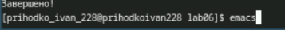
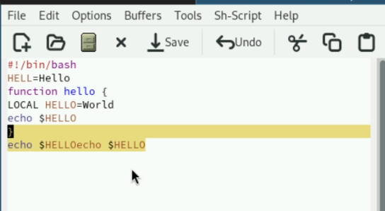
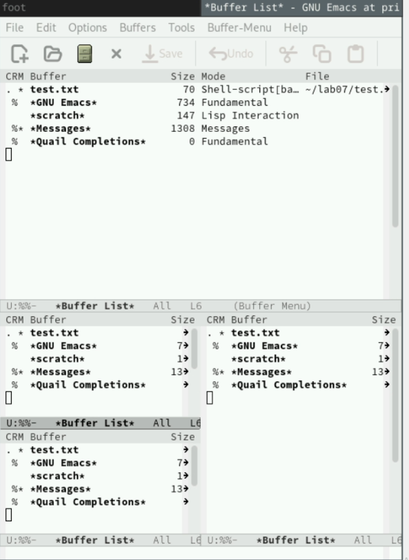

## Front matter
lang: ru-RU
title: Лабораторная работа №11
subtitle: Презентация
author:
  - Приходько И. И.
institute:
  - Российский университет дружбы народов, Москва, Россия

## i18n babel
babel-lang: russian
babel-otherlangs: english

## Formatting pdf
toc: false
toc-title: Содержание
slide_level: 2
aspectratio: 169
section-titles: true
theme: metropolis
header-includes:
 - \metroset{progressbar=frametitle,sectionpage=progressbar,numbering=fraction}
---

# Информация

## Докладчик

:::::::::::::: {.columns align=center}
::: {.column width="70%"}

  * Приходько Иван Иванович
  * Студент
  * Российский университет дружбы народов
  * [1132246285@pfur.ru](mailto:1132246285@pfur.ru)

:::
::: {.column width="30%"}

:::
::::::::::::::

## Цель работы

Научится работать с редактором emacs

## Задание

1. Открыть emacs.
2. Создать файл lab07.sh с помощью комбинации Ctrl-x Ctrl-f (C-x C-f).
3. Наберите текст:
4. Сохранить файл с помощью комбинации Ctrl-x Ctrl-s (C-x C-s).
5. Проделать с текстом стандартные процедуры редактирования, каждое действие долж-
но осуществляться комбинацией клавиш.
6. Научитесь использовать команды по перемещению курсора.
7. Управление буферами.
4. Сохранить файл с помощью комбинации Ctrl-x Ctrl-s (C-x C-s).
5. Проделать с текстом стандартные процедуры редактирования, каждое действие долж-
6. Научитесь использовать команды по перемещению курсора.
7. Управление буферами.
9. Режим поиска

## Работа c emacs

Для начала запустим emacs

## Работа c emacs

Нас встречает такое меню

## Работа c emacs

Далее мы немного поработали с горячими клавишами и поиском слов в emacs

## Работа c emacs

И наконец мы разобрались с работой с фреймами в emacs

## Выводы

В ходе данной лабораторной работы были получены знания для работы с emacs

